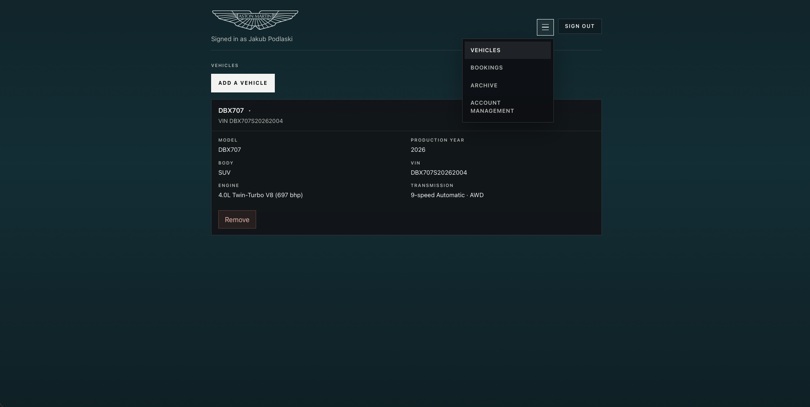

# Aston Martin ASO Service

Web application for an **Authorized Service Organization (ASO)**. Clients register, add Aston Martin vehicles, and request service. A **consultant** confirms the appointment; a **mechanic** (or apprentice) claims the job, updates the work plan, and completes service. Management creates workshop accounts. Branded notification emails are sent at each step; completion includes a PDF invoice.

---

## Stack

| Layer | Technology |
|-------|------------|
| API | Spring Boot 4, Java 21, Spring Security (JWT), JPA, Flyway |
| Database | PostgreSQL 16 |
| Frontend | React (Vite), Axios, React Router |
| Email rendering | Clojure HTTP service (`clojure/email-renderer`) |
| Local SMTP | MailHog |
| CI | GitHub Actions (Maven tests + frontend lint/build) |

---

## Features

- **Clients** — register (email verification), login, forgot/reset password, change password, account deletion (email confirm), add/remove vehicles from catalog, request service, cancel bookings (reason required), download invoice for completed jobs, archive of past bookings
- **Consultants** — accept incoming requests (set appointment → ready for work), reject or cancel with reason, view workshop progress and archive
- **Mechanics / apprentices** — claim ready jobs, update work plan and estimated cost, complete with final cost (invoice), cancel assigned work
- **Management** (`ADMIN`, `CEO`, `COO`) — create/update/delete workers, view all bookings
- **Auth** — BCrypt passwords, Bearer JWT; actor identity always from the token (not from request body IDs)
- **Emails** — async outbox → Clojure HTML/text templates → SMTP (MailHog locally); completion attaches a branded PDF invoice
- **Schema** — Flyway migrations; Hibernate `validate` only

---

## Quick start

Build the API JAR, then start the full stack:

```bash
./mvnw package -DskipTests
docker compose up --build
```

Five containers should be running:

| Service | URL |
|---------|-----|
| API | http://localhost:8080 |
| Frontend | http://localhost:5173 |
| MailHog UI | http://localhost:8025 |
| Email renderer | http://localhost:3000 |
| Postgres | `localhost:5432` (`aso_service_db`) |

```bash
docker compose ps
```

### Seeded account

On an empty database:

| Role | Login | Password |
|------|-------|----------|
| Admin | `admin` | `admin` |

Clients self-register in the UI. Consultants and mechanics are created from the management dashboard (intentional — demo starts from zero).

### Fresh database

```bash
docker compose down
rm -rf pgdata
./mvnw package -DskipTests
docker compose up --build
```

Stop containers **before** deleting `pgdata` (otherwise Postgres can leave a corrupted data directory). The API waits until Postgres is healthy, then seeds `admin` / `admin` on an empty DB.

---

## Demo walkthrough

1. Open http://localhost:5173/register — create a client account.
2. Open http://localhost:8025 — open the verification email and click the link (or copy the token URL).
3. Sign in at http://localhost:5173/login with the verified account.
4. Add a vehicle (`/client/add-vehicle`) using the Aston Martin catalog.
5. Request service (`/client/request-service`) with drop-off time and availability notes (if there are any).
6. Sign out → http://localhost:5173/employee-login — log in as `admin` / `admin`.
7. On the management dashboard, create:
   - a **client service consultant**
   - a **mechanic** (or apprentice)
8. Sign out → log in as the **consultant** → accept the request and set an appointment time (status → `READY_FOR_WORK`). Client receives **appointment confirmed**.
9. Sign out → log in as the **mechanic** → claim the job (client receives **drop off your vehicle**), update work planned if needed, complete with a final cost (invoice PDF).
10. Open http://localhost:8025 — check the email sequence. Client can also download the invoice from Bookings → Archive.

Forgot password: `/forgot-password` → check MailHog → `/reset-password?token=…`.

Account deletion: client Account section → confirm via email link → `/confirm-account-deletion?token=…`.

Any signed-in user can change their password from their dashboard.

---

## Architecture

```
Client / Staff UI (React)
        │  Bearer JWT
        ▼
   Spring Boot API
        │
        ├── PostgreSQL (Flyway schema)
        ├── Email renderer (Clojure) ──► HTML/text bodies
        └── SMTP (MailHog in dev) ──► emails + optional PDF
```

**Booking lifecycle**

```
SCHEDULED ──consultant accept──► READY_FOR_WORK ──mechanic claim──► IN_PROGRESS ──complete──► COMPLETED
    │                │                    │                              │
    │ reject         │ cancel             │ cancel                       │
    └────────────────┴────────────────────┴──────────────────────────────┴──► CANCELLED
```

| Status | Meaning |
|--------|---------|
| `SCHEDULED` | Client request awaiting consultant |
| `READY_FOR_WORK` | Appointment confirmed; waiting for a technician |
| `IN_PROGRESS` | Claimed by a mechanic / apprentice |
| `COMPLETED` | Finished; invoice available |
| `CANCELLED` | Rejected or cancelled (client, consultant, or worker) |

Workshop hours for drop-off / pickup: **06:00–20:00** (Sportowa 31, Łódź).

---

## Authentication

| Endpoint | Who | Notes |
|----------|-----|--------|
| `POST /auth/register` | Public | Creates client (unverified), sends welcome + verify emails |
| `POST /auth/login` | Public | Client login (email + password); requires verified email |
| `POST /auth/employee-login` | Public | Worker/admin login (`login` + password) |
| `POST /auth/forgot-password` | Public | Sends reset link if email exists (generic response) |
| `POST /auth/reset-password` | Public | Sets new password with one-time token |
| `POST /auth/verify-email` | Public | Marks client email verified with one-time token |
| `POST /auth/resend-verification` | Public | Resends verify link if still unverified (generic response) |
| `POST /auth/change-password` | Authenticated | Current + new password (min 8 chars) |
| `POST /auth/request-account-deletion` | Client | Sends confirmation email |
| `POST /auth/confirm-account-deletion` | Public | Deletes account with one-time token |

Public routes: the auth endpoints above, `GET /hello`, `GET /vehicles/catalog`. Everything else requires `Authorization: Bearer <token>`.

Frontend helpers: `/forgot-password`, `/reset-password?token=…`, `/verify-email?token=…`, `/resend-verification`, `/confirm-account-deletion?token=…`. Check MailHog at http://localhost:8025 for links in local demos.

JWT payload drives authorization via `AuthSupport`. Prefer self routes: `/vehicles/me`, `/customers/me/bookings`, `/workers/me/bookings`.

**Roles**

| Role | Access |
|------|--------|
| `CLIENT` | Own vehicles and bookings |
| `CLIENT_SERVICE_CONSULTANT` | Incoming requests; accept / reject / cancel; workshop overview + archive |
| `MECHANIC`, `APPRENTICE_MECHANIC` | Claim `READY_FOR_WORK` jobs; work plan; complete / cancel assigned work |
| `ADMIN`, `CEO`, `COO` | Worker management + all bookings |

Env overrides: `APP_JWT_SECRET` (min 32 characters), `APP_JWT_EXPIRATION_MS` (default 24h).

---

## Booking API

Identity of the acting user always comes from the JWT.

```bash
# Client token
CLIENT_TOKEN=$(curl -s -X POST http://localhost:8080/auth/login \
  -H 'Content-Type: application/json' \
  -d '{"login":"you@example.com","password":"yourpassword"}' \
  | python3 -c "import json,sys; print(json.load(sys.stdin)['token'])")

# Create booking (vehicle must belong to the client)
curl -s -X POST http://localhost:8080/bookings \
  -H "Authorization: Bearer $CLIENT_TOKEN" \
  -H 'Content-Type: application/json' \
  -d '{"vehicleId":1,"customerDescription":"Noise when braking","estimatedDropOffTime":"2026-06-15T10:30:00","availabilityNotes":"Tuesday mornings"}'

# Consultant accepts and sets appointment → READY_FOR_WORK
CONSULTANT_TOKEN=$(curl -s -X POST http://localhost:8080/auth/employee-login \
  -H 'Content-Type: application/json' \
  -d '{"login":"consultant1","password":"secret123"}' \
  | python3 -c "import json,sys; print(json.load(sys.stdin)['token'])")

curl -s -X POST http://localhost:8080/bookings/1/accept \
  -H "Authorization: Bearer $CONSULTANT_TOKEN" \
  -H 'Content-Type: application/json' \
  -d '{"scheduledDateTime":"2026-06-16T14:00:00"}'

# Mechanic claims → IN_PROGRESS
MECHANIC_TOKEN=$(curl -s -X POST http://localhost:8080/auth/employee-login \
  -H 'Content-Type: application/json' \
  -d '{"login":"mechanic1","password":"secret123"}' \
  | python3 -c "import json,sys; print(json.load(sys.stdin)['token'])")

curl -s -X POST http://localhost:8080/bookings/1/claim \
  -H "Authorization: Bearer $MECHANIC_TOKEN" \
  -H 'Content-Type: application/json' \
  -d '{"estimatedCost":350.00,"serviceTypes":["Brake inspection"]}'

# Optional: update work plan while in progress
curl -s -X POST http://localhost:8080/bookings/1/work-plan \
  -H "Authorization: Bearer $MECHANIC_TOKEN" \
  -H 'Content-Type: application/json' \
  -d '{"estimatedCost":500.00,"serviceTypes":["Brake pads replace"]}'

curl -s -X POST http://localhost:8080/bookings/1/complete \
  -H "Authorization: Bearer $MECHANIC_TOKEN" \
  -H 'Content-Type: application/json' \
  -d '{"finalCost":375.50}'
```

| Action | Endpoint | Who |
|--------|----------|-----|
| Create | `POST /bookings` | Client |
| Accept (appointment) | `POST /bookings/{id}/accept` | Consultant |
| Claim | `POST /bookings/{id}/claim` | Mechanic / apprentice |
| Update work plan | `POST /bookings/{id}/work-plan` | Assigned technician |
| Complete | `POST /bookings/{id}/complete` | Assigned technician |
| Reject | `POST /bookings/{id}/reject` | Consultant (unclaimed `SCHEDULED`) |
| Cancel | `POST /bookings/{id}/cancel` | Client, consultant, or assigned worker |
| Invoice PDF | `GET /bookings/{id}/invoice` | Owning client (completed only) |

---

## Emails

Branded HTML templates are rendered by the Clojure service. Local delivery is via MailHog.

**Booking email sequence**

```
created → appointment confirmed (consultant accept)
       → drop off your vehicle (mechanic claim)
       → work plan updated (optional)
       → service completed + invoice PDF
```

| Event | When |
|-------|------|
| `customer_registered` | Client signup |
| `email_verification` | Verify / resend verify |
| `password_reset` / `password_changed` | Reset flow / password change |
| `account_deletion` / `account_deleted` | Account deletion request / confirmed |
| `vehicle_added` / `vehicle_removed` | Vehicle changes |
| `created` | Service request submitted |
| `appointment_scheduled` | Consultant accepts — appointment time confirmed; drop-off message comes later |
| `technician_assigned` | Mechanic claims — please drop off at the scheduled time |
| `work_plan_updated` | Technician updates planned work / estimate |
| `booking_rejected` | Consultant declines request |
| `booking_cancelled` | Client, consultant, or worker cancels |
| `booking_completed` | Finished — invoice PDF attached; pickup hours noted |

Flow: domain change + `email_outbox` PENDING row commit together → after-commit async send →
Clojure `POST /render/...` → SMTP. If the process crashes or SMTP fails, a scheduled poller retries
PENDING rows with backoff (up to `max_attempts`, then `FAILED`).

After changing email templates:

```bash
docker compose up -d --build --force-recreate email-renderer
```

---

## Frontend

Runs in Docker with the stack (no local Node required for the demo). The frontend container bind-mounts `aso-frontend/`, so UI edits hot-reload.

| Page | URL |
|------|-----|
| Landing | http://localhost:5173/ |
| Client login | http://localhost:5173/login |
| Register | http://localhost:5173/register |
| Client dashboard | http://localhost:5173/client |
| Staff login | http://localhost:5173/employee-login |
| Employee dashboard | http://localhost:5173/employee |
| Management dashboard | http://localhost:5173/admin |

Optional local UI: `cd aso-frontend && npm install && npm run dev`

---

## Database

Migrations: `src/main/resources/db/migration/`. Flyway applies them on startup; Hibernate only validates.

Test database: `aso_service_test` (see `src/test/resources/application-test.properties`).

---

## Tests

```bash
# Create test DB once (Postgres from docker compose is fine)
docker exec aso-postgres psql -U postgres -c "CREATE DATABASE aso_service_test;"

./mvnw test
```

Coverage includes authorization, booking lifecycle (accept → claim → complete), concurrent claim, account deletion, vehicles, email outbox, and password change.

```bash
# Email renderer (Clojure CLI, or via Docker image)
docker run --rm -v "$PWD/clojure/email-renderer:/app" -w /app \
  clojure:temurin-21-tools-deps clojure -M:test
```

CI (`.github/workflows/ci.yml`) runs Maven tests/package and frontend lint/build on push and pull requests.

---

## Project layout

```
aso-service/
├── src/main/java/com/sanproject/aso_service/
│   ├── AsoServiceApplication.java
│   ├── config/           Spring config, exception handler, demo seed
│   ├── security/         JWT, password hashing, auth helpers
│   ├── domain/           JPA entities and enums
│   ├── repository/       Spring Data repositories
│   ├── dto/              Request/response payloads
│   ├── controller/       REST controllers
│   ├── service/          Business logic
│   ├── email/            Outbox, SMTP, renderer client, invoice hooks
│   └── catalog/          Vehicle catalog models + loader
├── src/main/resources/
│   ├── db/migration/     Flyway SQL
│   ├── catalog/          Aston Martin vehicle catalog JSON
│   └── email/            Invoice / email logo asset
├── src/test/java/...     Integration tests
├── aso-frontend/src/
│   ├── pages/
│   │   ├── Landing.jsx
│   │   ├── auth/         Login, register, password, verify, delete
│   │   ├── client/       Dashboard, add vehicle, request service
│   │   ├── employee/     Consultant / mechanic dashboard
│   │   └── admin/        Management dashboard
│   ├── components/
│   ├── services/
│   ├── constants/
│   └── utils/
├── clojure/email-renderer/
├── .github/workflows/    CI
└── docker-compose.yml
```

---

## Rebuild after code changes

**API (Java):** the `app` image uses the JAR from `target/`:

```bash
./mvnw package -DskipTests
docker compose up -d --build --force-recreate app
```

**Email templates (Clojure):**

```bash
docker compose up -d --build --force-recreate email-renderer
```

**Frontend:** usually no rebuild needed (bind mount). Full image rebuild only if `aso-frontend/Dockerfile` or dependencies change.
